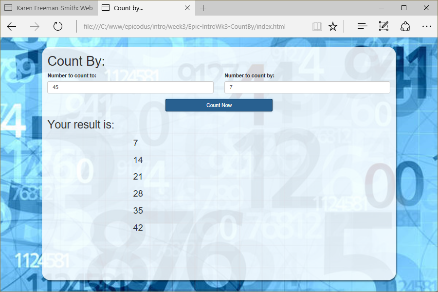

# Count Up By
Version 0.0.2: August 16, 2016
by [Karen Freeman-Smith](https://karenfreemansmith.github.io) and [Katy Henning](https://katycodes.github.io/portfolio)

### Technologies Used
HTML, CSS, Bootstrap, JavaScript, jQuery

## Description
*[Epicocus](http://epicodus.com) Intro to Programming Week 3 Pair Project with Katy Henning: A webpage that will count by your number (2s, 4s, 5s, etc.)*

* Version 0.0.2 - Improves error handling and user interface

## Setup/Installation
* [View on Github Pages](https://karenfreemansmith.github.io/Epic-IntroWk3-CountBy)
* _OR_
* Clone directory
* Open index.html in your favorite browser

## Support & Contact
For questions, concerns, or suggestions please email karenfreemansmith@gmail.com

## Known Issues
* None

## Legal
*Licensed under the GNU General Public License v3.0*

Copyright (c) 2016 Copyright _[Karen Freeman-Smith](https://karenfreemansmith.github.io) & [Katy Henning](https://katycodes.github.io/portfolio)_ All Rights Reserved.
